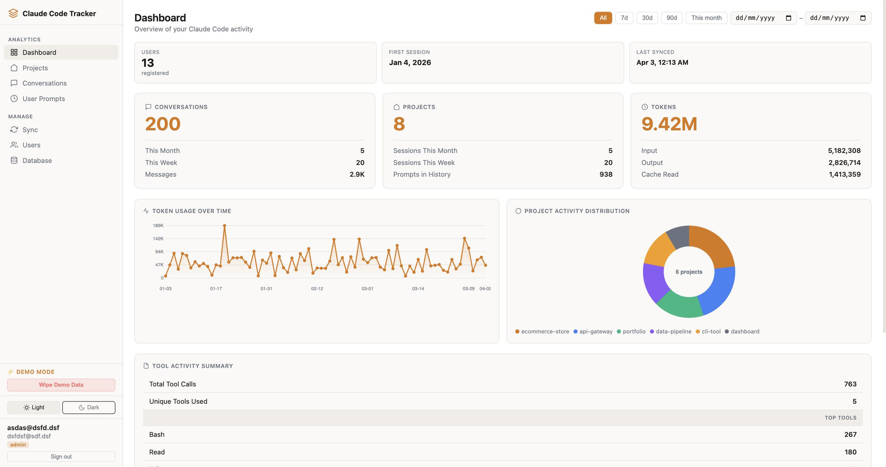

# Claude Code Tracker

> A self-hosted, multi-user analytics dashboard for [Claude Code](https://claude.ai/code) — track sessions, conversations, token usage, and activity across your whole team.


**[Live Demo →](https://claude-code-tracker-production.up.railway.app)**

---

## Overview

Claude Code Tracker lets you (and your team) sync local `~/.claude/` data to a central server and explore it through a clean web dashboard. Every session, conversation, tool call, and prompt is indexed and searchable. Admins get a full cross-user view; individual users see only their own data.

---

## Features

| Area | Details |
|---|---|
| **Dashboard** | Conversations, projects & token metric cards; token usage line chart; project donut chart; tool activity summary; daily activity line chart; model usage breakdown |
| **Date Range Filter** | Filter the entire dashboard by preset (7d / 30d / 90d / This month) or custom From–To date range |
| **Projects** | All projects grouped by ID with session counts, message totals, and per-user filtering |
| **Conversations** | Full session list — searchable, filterable by project and user |
| **User Prompts** | Complete command history, searchable and filterable |
| **Sync** | One-liner sync command, personal auth token, cron setup guide |
| **Admin — Users** | All users table, "View Data" impersonation, role management, delete users/data |
| **Admin — Database** | Live DB stats, backup download, backup restore, VACUUM |
| **Demo Mode** | Seed realistic demo data with one click; wipe it just as fast |
| **Themes** | Light and Dark mode with OS preference auto-detection and manual toggle |

---

## Screenshots



---

## Tech Stack

- **Backend** — Node.js, Express, SQLite (`better-sqlite3`), zlib compression
- **Auth** — JWT + bcrypt, role-based (`admin` / `user`)
- **Frontend** — Vanilla HTML/CSS/JS, zero build step
- **Deployment** — Docker

---

## Getting Started

### Prerequisites

- Node.js ≥ 18
- npm

### Run as a Node.js App

```bash
# Clone the repo
git clone https://github.com/m-shirt/claude-code-tracker.git
cd claude-code-tracker

# Install dependencies
npm install

# Set up environment variables
cp .env.example .env
# Edit .env and set JWT_SECRET to a strong random string

# Start the server
npm start
```

Open [http://localhost:3456](http://localhost:3456) — the first user to register automatically becomes **admin**.

For development with auto-restart on file changes:

```bash
npm run dev
```

To run in the background as a persistent process using `pm2`:

```bash
npm install -g pm2
pm2 start server.js --name claude-tracker
pm2 save         # persist across reboots
pm2 logs claude-tracker   # view logs
```

---

## Syncing Your Data

Once logged in, go to the **Sync** page to get your personal one-liner. It looks like this:

```bash
curl -fsSL http://your-server/sync-client.js | node - \
  --url http://your-server \
  --token YOUR_JWT_TOKEN
```

The sync client reads `~/.claude/` (sessions, history, stats) and uploads it to the server. It runs entirely from a single script — no install required.

**Options:**

| Flag | Description |
|---|---|
| `--url` | Server URL (required) |
| `--token` | Your JWT token from the Sync page (required) |
| `--dry-run` | Show stats without uploading |
| `--max-sessions N` | Limit sessions per project (useful for large datasets) |
| `--claude-dir PATH` | Custom path to Claude data dir (default: `~/.claude`) |

**Automate with cron:**

```bash
# Sync every hour
0 * * * * curl -fsSL http://your-server/sync-client.js | node - --url http://your-server --token YOUR_TOKEN
```

---

## Deployment

### Docker

```bash
docker build -t claude-tracker .
docker run -p 3456:3456 \
  -v $(pwd)/data:/data \
  -e JWT_SECRET=your-secret-here \
  claude-tracker
```

---

## Environment Variables

| Variable | Default | Description |
|---|---|---|
| `PORT` | `3456` | Server port |
| `JWT_SECRET` | *(insecure default)* | **Set this in production** |
| `DB_PATH` | `./data/tracker.db` | Path to the SQLite database file |
| `NODE_ENV` | `development` | Set to `production` in prod |
| `DISABLE_DEMO_MODE` | `false` | Set to `true` to hide Demo Mode sidebar and disable seed/wipe endpoints |
| `DISABLE_DEMO_WIPE` | `false` | Set to `true` to hide the Wipe Demo Data button |

---

## Project Structure

```
claude-code-tracker/
├── server.js              # Express app entry point
├── db.js                  # SQLite setup & helpers
├── sync-client.js         # CLI sync script (served at /sync-client.js)
├── routes/
│   ├── auth.js            # Login, register, token
│   ├── sync.js            # Data upload endpoint
│   ├── data.js            # Dashboard, projects, sessions, history
│   └── admin.js           # Admin: users, database, demo mode
├── middleware/
│   └── auth.js            # JWT auth + admin guard
├── public/
│   ├── app.html           # Main SPA
│   ├── login.html         # Login / register page
│   └── sync-client.js     # Public-facing sync script
└── scripts/
    └── seed-demo.js       # Demo data seeder
```

---

## Dependencies

### Production

| Package | Version | Purpose |
|---|---|---|
| [`express`](https://expressjs.com) | ^4.18.2 | HTTP server and routing |
| [`better-sqlite3`](https://github.com/WiseLibs/better-sqlite3) | ^9.4.3 | SQLite database — fast, synchronous, no separate process |
| [`bcrypt`](https://github.com/kelektiv/node.bcrypt.js) | ^5.1.1 | Password hashing |
| [`jsonwebtoken`](https://github.com/auth0/node-jsonwebtoken) | ^9.0.2 | JWT auth token signing and verification |
| [`cors`](https://github.com/expressjs/cors) | ^2.8.5 | Cross-origin request headers |

### Dev Only

| Package | Version | Purpose |
|---|---|---|
| [`nodemon`](https://nodemon.io) | ^3.0.1 | Auto-restart server on file changes during development |

All dependencies are installed via:

```bash
npm install
```

No native addons are required except `better-sqlite3` which compiles a small C++ binding automatically during `npm install`. Node.js ≥ 18 and a standard C++ build toolchain (pre-installed on most systems) are sufficient.

---

## Roles & Permissions

| Action | User | Admin |
|---|---|---|
| View own data | ✅ | ✅ |
| View all users' data | ❌ | ✅ |
| Impersonate / view as user | ❌ | ✅ |
| Manage users (delete, clear data) | ❌ | ✅ |
| Access Database page | ❌ | ✅ |
| Seed / wipe demo data | ❌ | ✅ |

> The **first registered user** automatically receives the `admin` role.

---

## Demo Mode

Admins can seed realistic demo data (multiple users, projects, sessions) with one click from the sidebar — great for showcasing the app. Wipe it just as easily when done.

---

## Contributing

Contributions are welcome! Please open an issue first to discuss what you'd like to change.

1. Fork the repo
2. Create a feature branch (`git checkout -b feature/my-feature`)
3. Commit your changes (`git commit -m 'Add my feature'`)
4. Push to the branch (`git push origin feature/my-feature`)
5. Open a Pull Request

---

## License

MIT © 2025 — see [LICENSE](LICENSE) for details.

